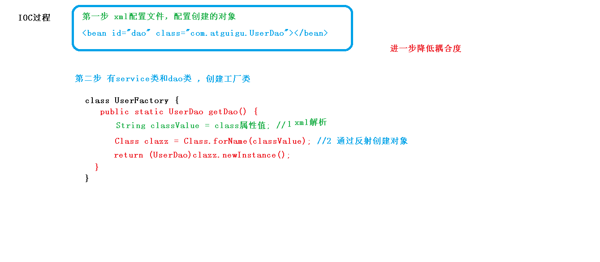

# IOC
1. 什么是 IOC
    - 控制反转，把对象创建和对象之间的调用过程，交给 Spring 进行管理
    - 使用 IOC 目的：为了耦合度降低
    - 做入门案例就是 IOC 实现
2. IOC 底层原理
    - xml 解析
    - 工厂模式
    - 反射
3. 画图讲解 IOC 底层原理
    - 使用工厂模式降低耦合度

    - 结合xml解析和反射

