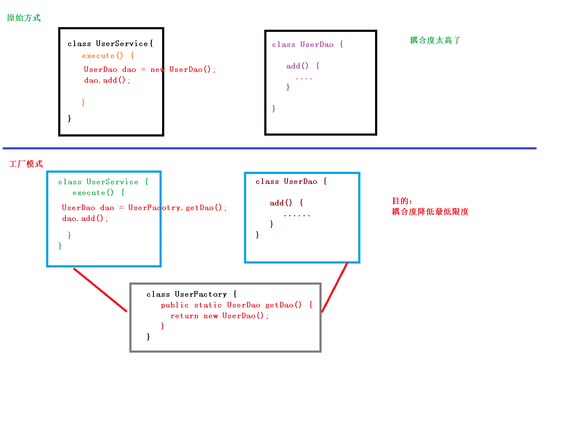
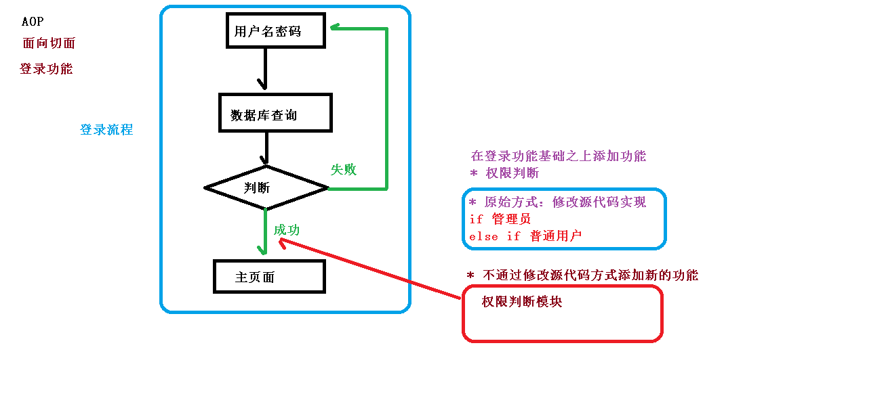
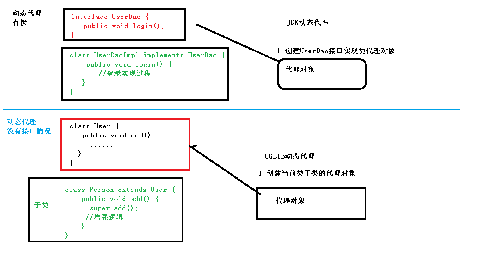
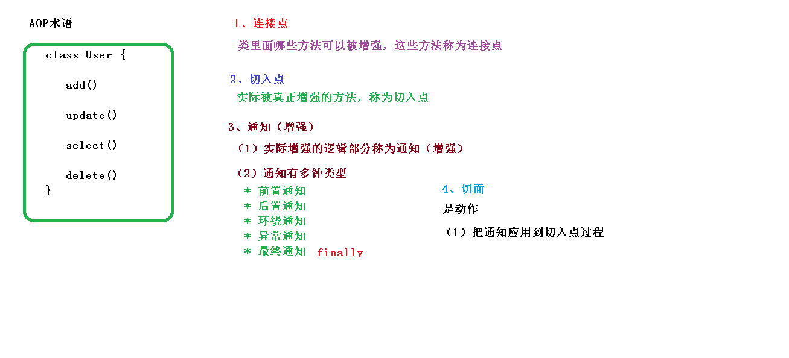

# SpringFramework

## Spring5框架概述
1. Spring 是轻量级的开源的 JavaEE 框架
2. Spring 可以解决企业应用开发的复杂性
3. Spring 有两个核心部分：IOC 和 Aop
    - IOC：控制反转，把创建对象过程交给 Spring 进行管理
    - Aop：面向切面，不修改源代码进行功能增强
4. Spring 特点
    - 方便解耦，简化开发
    - Aop 编程支持
    - 方便程序测试
    - 方便和其他框架进行整合
    - 方便进行事务操作
    - 降低 API 开发难度

## IOC(概念和原理)
1. 什么是 IOC
    - 控制反转，把对象创建和对象之间的调用过程，交给 Spring 进行管理
    - 使用 IOC 目的：为了耦合度降低
    - 做入门案例就是 IOC 实现

2. IOC 底层原理
    - xml 解析
    - 工厂模式
    - 反射

3. 画图讲解 IOC 底层原理
    - 使用工厂模式降低耦合度


    - 结合xml解析和反射


## IOC(BeanFactory接口)
1. IOC 思想基于 IOC 容器完成，IOC 容器底层就是对象工厂
2. Spring 提供 IOC 容器实现两种方式：（两个接口）
    - BeanFactory：IOC 容器基本实现，是 Spring 内部的使用接口，不提供开发人员进行使用

        **加载配置文件时候不会创建对象，在获取对象（使用）才去创建对象**

    - ApplicationContext：BeanFactory 接口的子接口，提供更多更强大的功能，一般由开发人员进行使用

        **加载配置文件时候就会把在配置文件对象进行创建**

3. ApplicationContext 接口实现类
    - FileSystemXmlApplicationContext
    - ClassPathXmlApplicationContext

## [IOC操作Bean管理](IOC操作Bean管理.md)

## AOP
### 概念
1. 什么是 AOP
    - （1）面向切面编程（方面），利用 AOP 可以对业务逻辑的各个部分进行隔离，从而使得
    业务逻辑各部分之间的耦合度降低，提高程序的可重用性，同时提高了开发的效率。
    - （2）通俗描述：不通过修改源代码方式，在主干功能里面添加新功能
    - （3）使用登录例子说明 AOP



### 底层原理
1. AOP 底层使用动态代理
    - （1）有两种情况动态代理
        * 第一种 有接口情况，使用 JDK 动态代理
            > 创建接口实现类代理对象，增强类的方法
        * 第二种 没有接口情况，使用 CGLIB 动态代理
            > 创建子类的代理对象，增强类的方法



### JDK动态代理
1. 使用 JDK 动态代理，使用 Proxy 类里面的方法创建代理对象
    - （1）调用 newProxyInstance 方法

        方法有三个参数：

        第一参数，类加载器

        第二参数，增强方法所在的类，这个类实现的接口，支持多个接口

        第三参数，实现这个接口 InvocationHandler，创建代理对象，写增强的部分

2. 编写 JDK 动态代理代码
    - （1）创建接口，定义方法
    ```java
    public interface UserDao {
    public int add(int a,int b);
    public String update(String id);
    }
    ```

    - （2）创建接口实现类，实现方法
    ```java
    public class UserDaoImpl implements UserDao {
    @Override
    public int add(int a, int b) {
    return a+b;
    }
    @Override
    public String update(String id) {
    return id;
    }
    }
    ```
    - （3）使用 Proxy 类创建接口代理对象
    ```java
    public class JDKProxy {
        public static void main(String[] args) {
        //创建接口实现类代理对象
        Class[] interfaces = {UserDao.class};
        // Proxy.newProxyInstance(JDKProxy.class.getClassLoader(), interfaces,
        new InvocationHandler() {
        // @Override
        // public Object invoke(Object proxy, Method method, Object[] args)
        throws Throwable {
        // return null;
        // }
        // });
        UserDaoImpl userDao = new UserDaoImpl();
        UserDao dao =
        (UserDao)Proxy.newProxyInstance(JDKProxy.class.getClassLoader(), interfaces,
        new UserDaoProxy(userDao));
        int result = dao.add(1, 2);
        System.out.println("result:"+result);
        }
    }
    //创建代理对象代码
    class UserDaoProxy implements InvocationHandler {
        //1 把创建的是谁的代理对象，把谁传递过来
        //有参数构造传递
        private Object obj;
        public UserDaoProxy(Object obj) {
        this.obj = obj;
        }
        //增强的逻辑
        @Override
        public Object invoke(Object proxy, Method method, Object[] args) throws
        Throwable {
        //方法之前
        System.out.println("方法之前执行...."+method.getName()+" :传递的参
        数..."+ Arrays.toString(args));
        //被增强的方法执行
        Object res = method.invoke(obj, args);
        //方法之后
        System.out.println("方法之后执行...."+obj);
        return res;
        }
    }
    ```

### 术语
1. 连接点
2. 切入点
3. 通知（增强）
4. 切面


## AOP操作
### 准备工作
1. Spring 框架一般都是基于 AspectJ 实现 AOP 操作
    - （1）AspectJ 不是 Spring 组成部分，独立 AOP 框架，一般把 AspectJ 和 Spirng 框架一起使
用，进行 AOP 操作
2. 基于 AspectJ 实现 AOP 操作
    - （1）基于 xml 配置文件实现
    - （2）基于注解方式实现（使用）
3. 在项目工程里面引入 AOP 相关依赖
4. 切入点表达式
    - （1）切入点表达式作用：知道对哪个类里面的哪个方法进行增强
    - （2）语法结构： 

```
execution([权限修饰符] [返回类型] [类全路径] [方法名称]([参数列表]) )

举例 1：对 com.atguigu.dao.BookDao 类里面的 add 进行增强
execution(* com.atguigu.dao.BookDao.add(..))
举例 2：对 com.atguigu.dao.BookDao 类里面的所有的方法进行增强
execution(* com.atguigu.dao.BookDao.* (..))
举例 3：对 com.atguigu.dao 包里面所有类，类里面所有方法进行增强
execution(* com.atguigu.dao.*.* (..))
```

### AspectJ注解
1. 创建类，在类里面定义方法
```java
public class User {
    public void add() {
        System.out.println("add.......");
    }
}
```
2. 创建增强类（编写增强逻辑）
    - （1）在增强类里面，创建方法，让不同方法代表不同通知类型

```java
//增强的类
public class UserProxy {
    public void before() {//前置通知
        System.out.println("before......");
    }
}
```

3. 进行通知的配置
    - （1）在 spring 配置文件中，开启注解扫描

    ```xml
    <?xml version="1.0" encoding="UTF-8"?>
    <beans xmlns="http://www.springframework.org/schema/beans"
    xmlns:xsi="http://www.w3.org/2001/XMLSchema-instance"
    xmlns:context="http://www.springframework.org/schema/context"
    xmlns:aop="http://www.springframework.org/schema/aop"
    xsi:schemaLocation="http://www.springframework.org/schema/beans
    http://www.springframework.org/schema/beans/spring-beans.xsd
    http://www.springframework.org/schema/context
    http://www.springframework.org/schema/context/spring-context.xsd
    http://www.springframework.org/schema/aop
    http://www.springframework.org/schema/aop/spring-aop.xsd">
    <!-- 开启注解扫描 -->
    <context:component-scan basepackage="com.atguigu.spring5.aopanno"></context:component-scan>
    ```

    - （2）使用注解创建 User 和 UserProxy 对象
    - （3）在增强类上面添加注解 @Aspect
    ```java
    //增强的类
    @Component
    @Aspect //生成代理对象
    public class UserProxy {
    ```

    - （4）在 spring 配置文件中开启生成代理对象
    ```xml
    <!-- 开启 Aspect 生成代理对象-->
    <aop:aspectj-autoproxy></aop:aspectj-autoproxy>
    ```

4. 配置不同类型的通知
    - （1）在增强类的里面，在作为通知方法上面添加通知类型注解，使用切入点表达式配置

    ```java
    //增强的类
    @Component
    @Aspect //生成代理对象
    public class UserProxy {
        //前置通知
        //@Before 注解表示作为前置通知
        @Before(value = "execution(* com.atguigu.spring5.aopanno.User.add(..))")
        public void before() {
            System.out.println("before.........");
        }
        //后置通知（返回通知）
        @AfterReturning(value = "execution(*
        com.atguigu.spring5.aopanno.User.add(..))")
        public void afterReturning() {
            System.out.println("afterReturning.........");
        }
        //最终通知
        @After(value = "execution(* com.atguigu.spring5.aopanno.User.add(..))")
        public void after() {
            System.out.println("after.........");
        }
        //异常通知
        @AfterThrowing(value = "execution(*
        com.atguigu.spring5.aopanno.User.add(..))")
        public void afterThrowing() {
            System.out.println("afterThrowing.........");
        }
        //环绕通知
        @Around(value = "execution(* com.atguigu.spring5.aopanno.User.add(..))")
        public void around(ProceedingJoinPoint proceedingJoinPoint) throws
        Throwable {
            System.out.println("环绕之前.........");
            //被增强的方法执行
            proceedingJoinPoint.proceed();
            System.out.println("环绕之后.........");
        }
    }
    ```

5. 相同的切入点抽取
```java
//相同切入点抽取
@Pointcut(value = "execution(* com.atguigu.spring5.aopanno.User.add(..))")
public void pointdemo() {
}
//前置通知
//@Before 注解表示作为前置通知
@Before(value = "pointdemo()")
public void before() {
    System.out.println("before.........");
}
```

6. 有多个增强类多同一个方法进行增强，设置增强类优先级
    - （1）在增强类上面添加注解 @Order(数字类型值)，数字类型值越小优先级越高

    ```java
    @Component
    @Aspect
    @Order(1)
    public class PersonProxy
    ```

7. 完全使用注解开发
    - （1）创建配置类，不需要创建 xml 配置文件

    ```java
    @Configuration
    @ComponentScan(basePackages = {"com.atguigu"})
    @EnableAspectJAutoProxy(proxyTargetClass = true)
    public class ConfigAop {
    }
    ```

### AspectJ配置文件
1. 创建两个类，增强类和被增强类，创建方法
2. 在 spring 配置文件中创建两个类对象
```xml
<!--创建对象-->
<bean id="book" class="com.atguigu.spring5.aopxml.Book"></bean>
<bean id="bookProxy" class="com.atguigu.spring5.aopxml.BookProxy"></bean>
```
3. 在 spring 配置文件中配置切入点
```xml
<!--配置 aop 增强-->
<aop:config>
    <!--切入点-->
    <aop:pointcut id="p" expression="execution(*
    com.atguigu.spring5.aopxml.Book.buy(..))"/>
    <!--配置切面-->
    <aop:aspect ref="bookProxy">
    <!--增强作用在具体的方法上-->
    <aop:before method="before" pointcut-ref="p"/>
    </aop:aspect>
</aop:config>
```

## [JdbcTemplate](JdbcTemplate.md)

