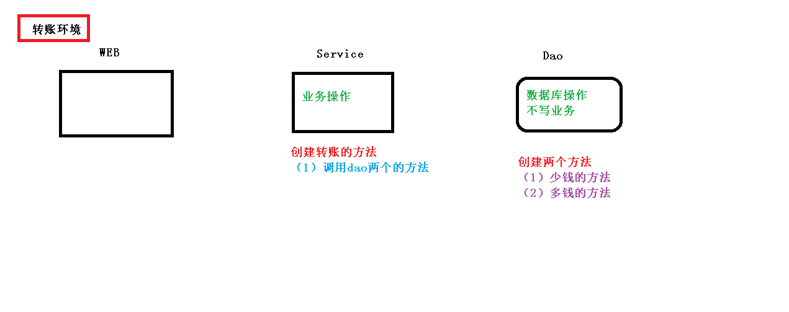

# 事务
## 事务概念
1. 什么事务
- （1）事务是数据库操作最基本单元，逻辑上一组操作，要么都成功，如果有一个失败所有操
作都失败
- （2）典型场景：银行转账
    * lucy 转账 100 元 给 mary
    * lucy 少 100，mary 多 100
2. 事务四个特性（ACID）
- （1）原子性
- （2）一致性
- （3）隔离性
- （4）持久性

## 搭建事务操作环境

1. 创建数据库表，添加记录
2. 创建 service，搭建 dao，完成对象创建和注入关系
- （1）service 注入 dao，在 dao 注入 JdbcTemplate，在 JdbcTemplate 注入 DataSource
```java
@Service
public class UserService {
 //注入 dao
 @Autowired
 private UserDao userDao;
}
@Repository
public class UserDaoImpl implements UserDao {
 @Autowired
 private JdbcTemplate jdbcTemplate;
}
```
3. 在 dao 创建两个方法：多钱和少钱的方法，在 service 创建方法（转账的方法）
```java
@Repository
public class UserDaoImpl implements UserDao {
 @Autowired
 private JdbcTemplate jdbcTemplate;
 //lucy 转账 100 给 mary
 //少钱
 @Override
 public void reduceMoney() {
 String sql = "update t_account set money=money-? where username=?";
 jdbcTemplate.update(sql,100,"lucy");
 }
 //多钱
 @Override
 public void addMoney() {
 String sql = "update t_account set money=money+? where username=?";
 jdbcTemplate.update(sql,100,"mary");
 }
}
@Service
public class UserService {
 //注入 dao
 @Autowired
 private UserDao userDao;
 //转账的方法
 public void accountMoney() {
 //lucy 少 100
 userDao.reduceMoney();
 //mary 多 100
 userDao.addMoney();
 }
}
```
4. 上面代码，如果正常执行没有问题的，但是如果代码执行过程中出现异常，有问题
- （1）上面问题如何解决呢？
    * 使用事务进行解决