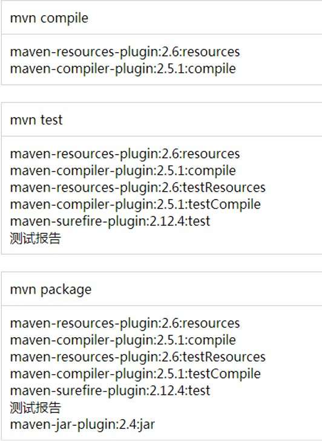

# POM
## 含义：Project Object Model
## 坐标：
使用下面三个向量在仓库中唯一定位一个Maven工程
1. groupid：公司或组织域名倒序 + 项目名
2. artifactid：模块名
3. version：版本
## 仓库
### 分类
- 本地仓库
- 远程仓库
    * 私服：搭建在局域网环境中，为局域网范围内的所有Maven工程服务
    * 中央仓库：假设在Internet上，为全世界所有Maven工程服务
    * 中央仓库镜像：为了分担中央仓库的流量，提升用户访问速度
### 仓库中保存的内容：Maven工程
1. Maven自身所需要的插件
2. 第三方框架或工具的jar包
3. 我们自己开发的Maven工程

## 依赖
1. compile范围依赖
    - 对主程序有效
    - 对测试程序有效
    - 参与打包
    - 参与部署
    - 如spring-core

2. test范围依赖
    - 对主程序无效
    - 对测试程序有效
    - 不参与打包
    - 不参与部署
    - 如junit

3. provided范围依赖
    - 对主程序有效
    - 对测试程序有效
    - 不参与打包
    - 不参与部署
    - 如servlet-api.jar

## 生命周期
1. 各个构建环节执行的顺序不能打乱，必须按照既定的正确顺序来执行。
2. Maven的核心程序中定义了抽象的生命周期，生命周期中各个阶段的具体任务是由插件来完成的。
3. Maven核心程序为了更好的实现自动化构建，按照这一特点执行生命周期的各个阶段。

4. 插件和目标
    * 生命周期的各个阶段仅仅定义了要执行的任务是什么
    * 各个阶段和插件的目标是对应的
    * 相似的目标由特定的插件来完成

## 配置Maven默认jdk版本
```shell
<profile>
    <id>jdk-11</id>

    <activation>
        <activeByDefault>true</activeByDefault>
        <jdk>11</jdk>
    </activation>

    <properties>
        <maven.compiler.source>11</maven.compiler.source>
        <maven.compiler.target>11</maven.compiler.target>
        <maven.compiler.compilerVersion>11</maven.compiler.compilerVersion>
    </properties>
</profile>
```

## 依赖【高级】
1. 依赖的传递性
> 注意：非compile范围的依赖不能传递。

2. 依赖的排除
    - 不稳定jar包，不希望加入当前工程
    - 
```shell
<exclusions>
    <exclusion>
        <groupId>commons-logging</groupId>
        <artifactId>commons-logging</artifactId>
    </exclusion>
</exclusions>
```

3. 依赖的原则
    - 作用：解决模块工程之间的jar包冲突问题
    - 场景设定
        * 路径最短者优先原则
        * 先声明者优先

4. 统一管理依赖的版本
```xml
<properties>
    <rekord.spring.version>4.0.0.RELEASE</rekord.spring.version>
</properties>
```
然后使用${var_name}对版本号进行替换。

## 继承
### 解决思路
将junit依赖统一提取到父工程中，在子工程中声明junit依赖时不指定版本，以父工程中统一设定的为准，同时也便于修改。
### 操作步骤
1. 创建一个Maven工程作为父工程。注意：**打包的方式为pom**
2. 在子工程中声明对父工程的引用
3. 将子工程的坐标中与父工程坐标中重复的内容删除
4. 在父工程中统一管理junit的依赖
5. 在子工程中删除junit依赖的版本内容

> 配置继承后，执行安装命令时要先安装父工程

## 聚合
1. 作用:一键安装各个模块工程
2. 配置方式：在一个“总的聚合工程"中配置各个参与聚合的模块
```xml
<modules>
    <module>../hello</module>
</modules>
```
3. 使用方式：对聚合的总工程执行`mvn install`